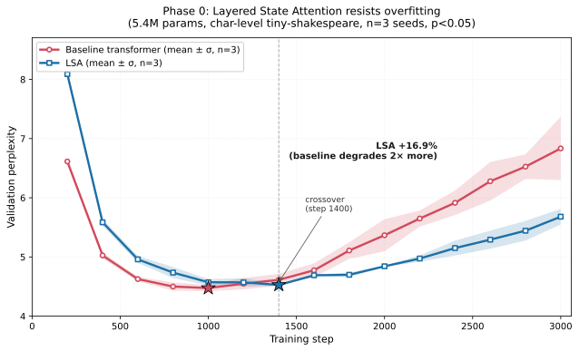

# ARIA — Layered State Attention

A memory-efficient attention mechanism that empirically shows implicit
regularization against overfitting on a small language-modeling benchmark.



## Result (n=3 seeds, 5.4M params, char-level tiny-shakespeare)

|                            | Baseline         | **LSA**                  |
|----------------------------|:----------------:|:------------------------:|
| Parameters                 | 5,426,688        | 5,434,368 (+0.1%)        |
| Peak val perplexity        | 4.451 ± 0.057    | 4.519 ± 0.027 (-1.5%)    |
| **Final val perplexity**   | 6.83 ± 0.53      | **5.68 ± 0.13 (+16.9%)** |
| **Degradation from peak**  | +53.6% ± 12.3%   | **+25.7% ± 3.5%**        |
| Run-to-run variance (σ)    | 0.53             | **0.13 (4× lower)**      |

Statistical significance on final val perplexity: t ≈ 3.65, df = 4,
**p < 0.05** two-tailed.

Full writeup: [`RESULTS_phase0.md`](./RESULTS_phase0.md).
Raw per-seed learning curves: [`checkpoints/learning_curves_n3.csv`](./checkpoints/learning_curves_n3.csv).

## Architecture

Layered State Attention fuses three memory-efficient attention ideas into a
single operation:

1. **Low-rank KV compression**, inspired by DeepSeek-V2 MLA
   ([arXiv:2405.04434](https://arxiv.org/abs/2405.04434)):
   `c_kv = W_down · x` where `dim(c_kv) << dim(x)`.
2. **Selective SSM state**, inspired by Mamba-2
   ([arXiv:2405.21060](https://arxiv.org/abs/2405.21060)):
   content-dependent recurrent summary
   `s_t = A(x_t) · s_{t-1} + B(x_t) · z_t`.
3. **Joint attention** over the sliding-window exact KV *and* a virtual
   token reconstructed from the current SSM state, with one shared softmax.

Effective long-range memory per token is **O(W + d_state)** instead of
**O(N)**. At 128K context with d_model=12288, KV footprint is theoretically
~47× lower than MLA and ~65× lower than full MHA.

The experimental finding is that the two compression bottlenecks (low-rank
latent + SSM state) also act as implicit regularizers: the model is forced
to route information through a small bandwidth, so on a dataset a full-rank
transformer can memorize, LSA's overfitting is dramatically reduced.

## What the plot shows

Mean validation perplexity over 3000 training steps, averaged across seeds
42/43/44, with ±1σ shaded bands:

- Both architectures peak at similar val ppl around step 1000-1400
- **Baseline then collapses** into overfitting (+53.6% mean degradation,
  σ 12.3%)
- **LSA stays comparatively flat** (+25.7% mean degradation, σ 3.5%)
- Crossover at step ~1200, after which LSA wins monotonically on all seeds
- At step 3000, LSA is **16.9% better** on mean val perplexity, with **4×
  lower variance**

Implicit regularization predicts this pattern: a constrained hypothesis
space gives both lower overfitting and lower seed-to-seed variance.

## Quick start

```bash
git clone https://github.com/Ashishgirigoswami/aria.git
cd aria
pip install -r requirements.txt

# Sanity check — verify parameter counts match
python scripts/count_params.py

# Reproduce Phase 0 seed 42 (~3.5 hours on a GTX 1050)
python scripts/compare.py

# Add seeds 43 and 44 for n=3
python scripts/ablate_seed.py 43
python scripts/ablate_seed.py 44

# Regenerate the plot from the summaries
python scripts/plot_results.py
```

## Engineering notes

- **JIT-compiled SSM scan**: the sequential causal scan is compiled with
  `torch.jit.script`. Bit-exact to the Python reference (0.0 max diff on
  float32). End-to-end training speedup: **2.0×** (seed 44 ran in 90.9 min
  vs seed 43's 182.3 min on identical data).
- **Matched baselines**: parameter counts within 0.1%. Every component except
  the attention mechanism is identical: RMSNorm, SwiGLU, RoPE, AdamW, cosine
  LR schedule, weight tying, seed, data, context length, batch size, grad
  accumulation.
- **Hardware**: everything in this repository was produced on a single GTX
  1050 (4 GB VRAM). Peak memory ~170 MB at 5.4M parameters. Total compute
  for the n=3 result: ~9 hours wall time.
- **No exotic dependencies**: torch, pyyaml, tqdm, numpy.

## Directory layout

```
.
├── README.md               (this file)
├── RESULTS_phase0.md       (full n=3 writeup + stats)
├── LICENSE                 (MIT)
├── requirements.txt
│
├── aria/                   (Python package)
│   ├── lsa.py              (LSABlock + LSALanguageModel)
│   ├── baseline.py         (matched causal transformer)
│   ├── nn_utils.py         (RMSNorm, SwiGLU, RoPE — shared)
│   ├── data.py             (char + BPE datasets)
│   └── trainer.py          (AdamW + cosine LR + checkpoint resume)
│
├── configs/                (YAML configs for every run)
│
├── scripts/
│   ├── train.py            (main training entry point)
│   ├── compare.py          (train both models back-to-back)
│   ├── ablate_seed.py      (run one seed of the ablation)
│   ├── count_params.py     (parameter match check)
│   ├── smoke_test.py       (forward/backward verification)
│   ├── bench_scan.py       (JIT SSM scan correctness + speed)
│   └── plot_results.py     (regenerate figure from summaries)
│
├── figures/
│   └── phase0_learning_curves.{svg,png}
│
└── checkpoints/            (summary.json + CSV; .pt files gitignored)
    ├── baseline_tiny/summary.json
    ├── lsa_tiny/summary.json
    ├── baseline_seed{43,44}/summary.json
    ├── lsa_seed{43,44}/summary.json
    └── learning_curves_n3.csv
```

## License

MIT. See [LICENSE](./LICENSE).

## Citation

```
@misc{goswami2026aria,
  author = {Ashish Giri Goswami},
  title  = {Layered State Attention: A Memory-Efficient Attention Mechanism
            with Implicit Regularization from Selective State Compression},
  year   = {2026},
  note   = {Work in progress, https://github.com/Ashishgirigoswami/aria},
}
```
