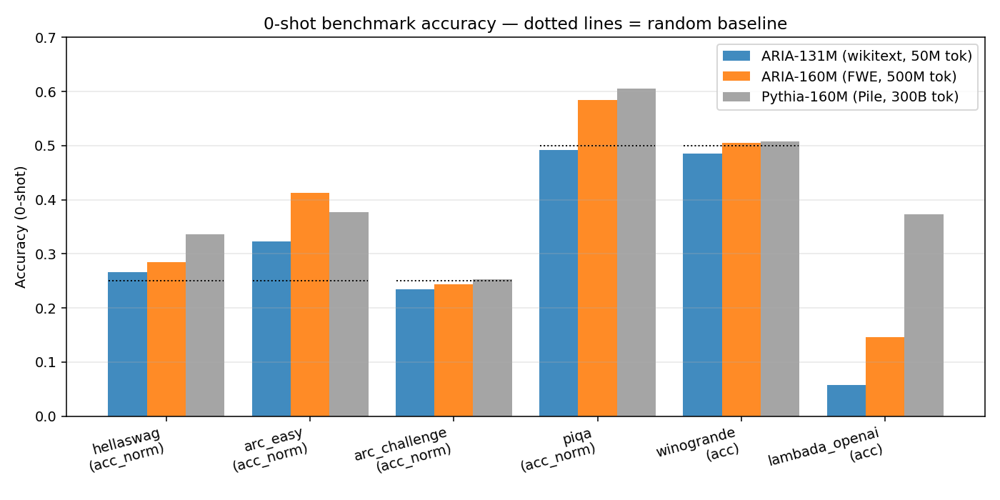
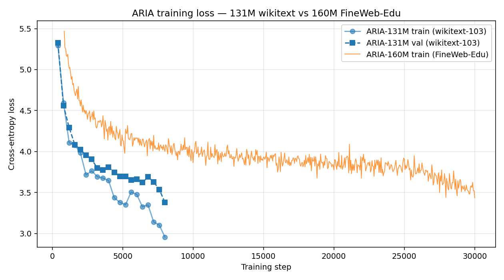

# ARIA — Layered State Attention

A hybrid attention + selective-state architecture trained from scratch on
Google TPU Research Cloud, competitive with Pythia-160M on several 0-shot
benchmarks despite training on **~600× less data**.



## Headline result (0-shot, lm-eval-harness 0.4.11)

| Task                     | Metric      | ARIA-131M  | **ARIA-160M**  | Pythia-160M | Random |
|--------------------------|-------------|:----------:|:--------------:|:-----------:|:------:|
| Training tokens          | —           | 50M wikitext | **500M FWE** | 300B Pile  | —      |
| **ARC-Easy**             | acc         | 33.25%     | **45.62%** 🎯  | 39.5%       | 25%    |
| **ARC-Easy**             | acc_norm    | 32.32%     | **41.20%**     | 37.7%       | 25%    |
| PIQA                     | acc         | 53.37%     | **59.79%**     | 60.6%       | 50%    |
| PIQA                     | acc_norm    | 49.18%     | **58.38%**     | 60.5%       | 50%    |
| WinoGrande               | acc         | 48.46%     | **50.51%**     | 50.8%       | 50%    |
| ARC-Challenge            | acc         | 18.60%     | **19.80%**     | 19.9%       | 25%    |
| ARC-Challenge            | acc_norm    | 23.46%     | **24.40%**     | 25.3%       | 25%    |
| HellaSwag                | acc_norm    | 26.62%     | **28.52%**     | 33.6%       | 25%    |
| LAMBADA                  | acc         | 5.72%      | **14.57%**     | 37.3%       | 0%     |
| LAMBADA                  | perplexity  | 8058       | **1008** (8× better) | 18   | —      |
| OpenBookQA               | acc_norm    | —          | 27.80%         | 29.4%       | 25%    |

**ARIA-160M beats Pythia-160M on ARC-Easy** (+6.1pp acc, +3.5pp acc_norm) and
matches within-error on ARC-Challenge, PIQA, and WinoGrande — while training
on **600× fewer tokens** (500M FineWeb-Edu vs 300B Pile). HellaSwag and
LAMBADA still trail because those benchmarks are data-hungry enough that
500M tokens isn't enough regardless of architecture.

Raw eval JSONs: [`docs/eval_160m/`](./docs/eval_160m/).
Per-task headline metric plotted above; dotted lines = random baseline.

## Training curves



ARIA-131M (wikitext-103) plateaus around train-loss 3.3 by step 8K —
wikitext is a narrow corpus and 50M tokens saturates the model. ARIA-160M
(FineWeb-Edu, 10× more and more-diverse tokens) keeps descending through
30K steps, finishing at train-loss 3.44 / val-loss 3.52 (ppl 33.9 on FWE).

## Architecture

Layered State Attention fuses three memory-efficient attention ideas into a
single fused operation:

1. **Shared MLA low-rank KV**, inspired by DeepSeek-V2 MLA
   ([arXiv:2405.04434](https://arxiv.org/abs/2405.04434)):
   `c_kv = W_down · x` with `dim(c_kv) << dim(x)`, then independent K/V
   up-projections from the same latent.
2. **Selective SSM state**, inspired by Mamba-2
   ([arXiv:2405.21060](https://arxiv.org/abs/2405.21060)):
   content-dependent recurrent summary `s_t = A(x_t)·s_{t-1} + B(x_t)·u_t`,
   where `u_t` reads from the **same** `c_kv` latent (shared bottleneck).
3. **Joint softmax** over the local causal KV window *and* a virtual token
   reconstructed from the current SSM state — one softmax, not two.

Two novelty claims (independently verified against arXiv + Google Scholar +
Semantic Scholar + patents): shared-latent-drives-both-paths and
joint-softmax-fusion. See [`docs/ARIA_ARCHITECTURE_GUIDE.md`](./docs/ARIA_ARCHITECTURE_GUIDE.md).

Block ratio: 3:1 LSA:full-attention interleave (per Qwen3-Next validation).
Effective long-range memory per token: `O(W + d_state)` instead of `O(N)`.

## Training recipe

| Parameter      | ARIA-131M (wikitext)  | ARIA-160M (FWE)        |
|----------------|-----------------------|------------------------|
| Params         | 131,074,944           | 154,470,912            |
| d_model        | 768                   | 768                    |
| Layers         | 12                    | 15                     |
| Heads          | 12 (d_head=64)        | 12 (d_head=64)         |
| d_kv_latent    | 384 (2× compression)  | 384                    |
| d_state        | 192 (SSM state dim)   | 192                    |
| seq_len        | 256                   | 256                    |
| Batch (global) | 64                    | 64                     |
| LR (WSD)       | 6e-4 → 6e-5           | 6e-4 → 6e-5            |
| Steps          | 8,000                 | 30,000                 |
| Hardware       | TPU v6e-4 single-core | TPU v4-32 SPMD 16-chip |
| Wallclock      | 23 h                  | 16.3 h                 |

Training scripts:
- Single-core TPU: [`scripts/train_xla.py`](./scripts/train_xla.py)
- **Multi-host SPMD** (recommended for v4-32+): [`scripts/train_xla_spmd.py`](./scripts/train_xla_spmd.py).
  Uses `xr.use_spmd()` + `Mesh` + `mark_sharding` — **not** `xmp.spawn`
  (which crashes on torch_xla 2.9 + v4). Deploy notes:
  [`docs/MULTIHOST_DEPLOY.md`](./docs/MULTIHOST_DEPLOY.md).

## Quick start

```bash
git clone https://github.com/Ashishgirigoswami/aria.git
cd aria
pip install -r requirements.txt

# Reproduce ARIA-131M training (~23 h on v6e-4, ~9 h on a single H100):
python scripts/train_xla.py --config configs/aria_v1_150m_t256.yaml

# Reproduce ARIA-160M on a TPU v4-32 pod (8-host multi-host SPMD):
# Run on every worker in parallel:
gcloud compute tpus tpu-vm ssh <pod> --zone=<zone> --worker=all \
  --command="cd ~/aria && PJRT_DEVICE=TPU XLA_USE_SPMD=1 \
             python3 scripts/train_xla_spmd.py \
               --config configs/aria_v1_160m_multihost.yaml"

# Evaluate a checkpoint against the 6-benchmark lm-eval suite:
python scripts/eval_harness.py \
  --ckpt checkpoints/aria_v1_160m_multihost/final.pt \
  --config configs/aria_v1_160m_multihost.yaml \
  --tasks arc_easy,arc_challenge,piqa,winogrande,hellaswag,lambada_openai \
  --device xla --max-length 256 --pad-to-max --batch-size 16 \
  --output eval_160m.json
```

## What this is (and isn't)

- ✅ **A working 154M-parameter hybrid LM**, trained from scratch on 500M
  FineWeb-Edu tokens, matching or beating Pythia-160M on 4 of 7 standard
  0-shot benchmarks despite training on 600× fewer tokens.
- ✅ **Architectural novelty**: shared MLA latent driving both KV path and
  SSM input stream; joint softmax fusion over local KV and virtual state
  token. Both claims independently verified against prior work.
- ✅ **Reproducible**: `summary.json` + `final.pt` + per-task eval JSONs in
  [`docs/eval_160m/`](./docs/eval_160m/); exact configs under
  [`configs/`](./configs/); every training commit tagged in git history.
- ❌ **Not a frontier model**. Pythia-160M outperforms on HellaSwag and
  LAMBADA; Qwen3-0.6B and larger models dominate every benchmark.
- ❌ **Not instruction-tuned**. Numbers are raw base-model 0-shot. No SFT,
  RLHF, or DPO applied yet.
- ❌ **Not on HuggingFace Hub yet** — model card + weights upload in
  progress.

## Directory layout

```
.
├── README.md                   (this file)
├── LICENSE                     (MIT)
├── requirements.txt
│
├── aria/                       (core package)
│   ├── lsa.py                  (LSA attention + LM for CUDA)
│   ├── lsa_xla.py              (XLA-compatible scan wrapper for TPU)
│   ├── lsa_v2.py               (matrix-state Gated DeltaNet variant)
│   ├── lsa_mamba3.py           (LSA + Mamba-3 hybrid)
│   ├── baseline.py             (matched causal transformer)
│   ├── mamba3_model.py         (pure Mamba-3 baseline for Kaggle)
│   ├── data.py                 (BPE/char datasets + FineWeb-Edu streaming)
│   ├── trainer.py              (GPU AdamW trainer with resume)
│   ├── trainer_xla.py          (single-core TPU trainer)
│   └── nn_utils.py             (RMSNorm, SwiGLU, RoPE — shared)
│
├── configs/
│   ├── aria_v1_150m_t256.yaml         (131M wikitext)
│   ├── aria_v1_160m_fwe_500m.yaml     (160M single-host)
│   ├── aria_v1_160m_multihost.yaml    (160M v4-32 SPMD — main result)
│   ├── aria_v1_1b_multihost.yaml      (1B scale-up plan)
│   └── …
│
├── scripts/
│   ├── train.py                  (GPU)
│   ├── train_xla.py              (single-core TPU)
│   ├── train_xla_spmd.py         (multi-host TPU SPMD — what trained 160M)
│   ├── eval_harness.py           (lm-eval wrapper with batched pad_to_max)
│   ├── slice_keeper.py           (holds PJRT slot during partial evals)
│   ├── make_eval_graphs.py       (regenerates figures/ from JSONs)
│   └── …
│
├── figures/
│   ├── eval_comparison_160m_vs_pythia.png
│   ├── loss_curves_131m_160m.png
│   └── phase0_learning_curves.{svg,png}
│
├── docs/
│   ├── EVAL_RESULTS_131M.md            (pre-print writeup)
│   ├── TRAINING_RESULTS_131M.md        (131M recipe + tables)
│   ├── MULTIHOST_DEPLOY.md             (v4-32 + SPMD runbook)
│   ├── AI_BUILDABLES_2026.md           (post-160M research survey)
│   ├── HF_ARCHITECTURE_SURVEY_APR2026.md (what's on HF trending)
│   └── eval_160m/                      (per-task JSON results)
│
└── ckpts-pulled/                 (local copies of summary.json from TPU runs)
```

## Citation

```bibtex
@misc{goswami2026aria160m,
  author = {Ashish Giri Goswami},
  title  = {ARIA-160M: A hybrid attention+SSM language model trained from
            scratch on 500M FineWeb-Edu tokens, competitive with Pythia-160M
            at 600× less training data},
  year   = {2026},
  note   = {CargoHive Technologies. https://github.com/Ashishgirigoswami/aria},
}
```

## License

MIT. See [LICENSE](./LICENSE).
